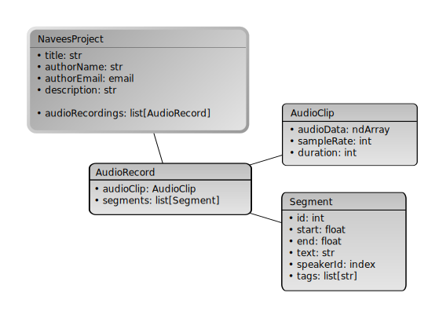

..  ****************************************************************************
    Copyright(c) 2025 RoXimn. All rights reserved.

    This work is licensed under the Creative Commons Attribution 4.0 International License.
    To view a copy of this license, visit # http://creativecommons.org/licenses/by/4.0/.

    Author:      RoXimn <roximn@rixir.org>
    ****************************************************************************

********************************************************************************
Data Model
********************************************************************************

   Data model diagram of the application.

The core object of this application is `NaveesProject`, which houses essential
metadata about the project, including its title, author details, and
a comprehensive description.

Additionally, it contains a list of audio records. Each audio record consists of
an audio clip and a list of transcribed segments.

.. raw:: latex

   \pagebreak

..  ****************************************************************************